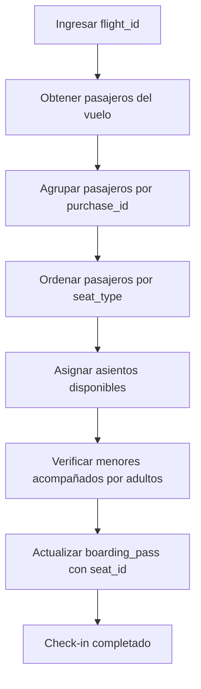

# Checkin-Bsale

## 📌 Descripción del Proyecto
Checkin-Bsale es un sistema diseñado para automatizar el proceso de **check-in de pasajeros en vuelos**, a partir de un `flight_id`.  
El proyecto tiene como objetivo asignar asientos a los pasajeros de forma automática, siguiendo reglas de negocio específicas y respetando las relaciones entre pasajeros, compras y tipos de asiento.

---

## ⚙️ Características Principales
- Automatización del **check-in** al ingresar un `flight_id`.
- Asignación automática de **asientos** (`seat_id`) en función de:
  - **Tipo de asiento** (`seat_type`) → define la clase (ej. económica, ejecutiva, primera).
  - **Relación de compra** (`purchase_id`) → asegura que los pasajeros de la misma compra viajen juntos.
  - **Restricciones de edad** → un **menor de edad siempre debe estar acompañado** por un adulto de la misma compra.
- Uso de **colecciones (Collection)** de Laravel para optimizar búsquedas y asignaciones.
- Diseño inicial con **Patrón Strategy** para asignación de asientos, que luego fue descartado debido a que los asientos ya estaban pre-generados en la base de datos.

---

## 🗄️ Modelado de Datos
El sistema se integra con una base de datos heredada, que incluye las siguientes tablas principales:

- **`boarding_pass`** → relación entre pasajero y asiento.
- **`seat`** → asientos disponibles en el vuelo.
- **`seat_type`** → clase/tipo de asiento (económica, ejecutiva, primera).
- **`purchase`** → agrupa pasajeros según la compra realizada.
- **`passenger`** → información del pasajero (edad, identificador, etc.).

---

## 🚀 Flujo del Proceso de Check-in


---

## 🔑 Lógica de Negocio
- Los pasajeros se agrupan por **`purchase_id`** para mantener la relación de compra.
- Los **menores de edad** se asignan junto a un **adulto de la misma compra**.
- Se asigna el asiento en base al **tipo de asiento (`seat_type`)** correspondiente.
- Una vez asignado, el asiento se elimina de la colección de disponibles para evitar duplicaciones.

Ejemplo simplificado en código:

```php
$passenger->boardingPasses
    ->firstWhere('passenger_id', $passenger->passenger_id)
    ->seat_id = $seat->seat_id;

$passenger->boardingPasses
    ->firstWhere('passenger_id', $passenger->passenger_id)
    ->save();
```

---

## 🛠️ Patrones de Diseño Utilizados
- **Strategy (descartado en la implementación final)** → se intentó aplicar para la lógica de asignación de asientos, pero se descartó ya que los asientos estaban definidos directamente en la base de datos.
- **Repository & Services** → separación de responsabilidades para mantener la lógica de negocio independiente de los controladores.
- **Collections de Laravel** → utilizadas para filtrar, mapear y asignar pasajeros de forma eficiente.

---

## 📂 Estructura del Proyecto
```bash
Checkin-Bsale/
│── app/
│   ├── Models/         # Modelos Eloquent (Passenger, Seat, SeatType, Purchase, BoardingPass)
│   ├── Services/       # Lógica de negocio (asignación de asientos, validaciones)
│   ├── Http/
│   │   ├── Controllers/ # Controladores de check-in
│
│── routes/
│   ├── web.php         # Rutas principales
│
│── README.md           # Documentación del proyecto
```

---

## ⚠️ Consideraciones Técnicas
- La base de datos heredada **no contiene timestamps** (`created_at`, `updated_at`) en todas las tablas, por lo que fue necesario **deshabilitar timestamps** en algunos modelos:
```php
class BoardingPass extends Model {
    public $timestamps = false;
}
```
- Se utilizó **Laravel Collections** para manipulación de datos en memoria.
- El sistema fue diseñado para **evitar consultas innecesarias** y optimizar la asignación de asientos.

---

## 📖 Conclusión
Checkin-Bsale implementa un sistema de check-in automático que respeta reglas de negocio complejas como la asignación por clase de asiento, la agrupación por compra y la compañía de menores con adultos.  
El diseño se orientó a mantener **separación de responsabilidades**, uso de **Eloquent y Collections**, y un **flujo claro y extensible**, apto para futuras mejoras.
